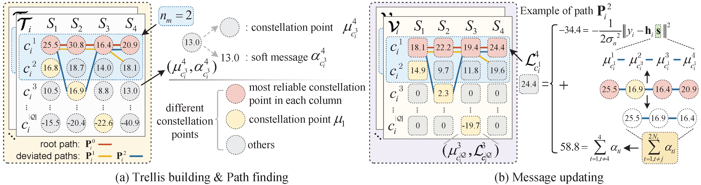

  

    <ul class="home-header-menu pure-menu-list">
      <li class="pure-menu-item"><a href="#about" class="pure-menu-link">About</a></li>
      <li class="pure-menu-item"><a href="#education" class="pure-menu-link">Education</a></li>
      <li class="pure-menu-item"><a href="#news" class="pure-menu-link">News</a></li>
      <li class="pure-menu-item"><a href="#research" class="pure-menu-link">Research</a></li>
      <li class="pure-menu-item"><a href="#publications" class="pure-menu-link">Publications</a></li>
    </ul>
  

## 👋 About {#about} 

Welcome! I’m **Zeqiong Tan**, an M.Eng. student in Information Engineering at [Southeast University (SEU)](https://www.seu.edu.cn/english/), China, under the supervision of [Prof. Chuan Zhang](https://radio.seu.edu.cn/2018/0423/c19937a213561/page.htm) and [Prof. Xiaosi Tan](https://radio.seu.edu.cn/newenglish/txs_en/main.psp).

---

## 🎓 Education {#education}

- *2023 - 2026 (Expected)*, M.Eng., Information and Communication Engineering, Southeast University, Nanjing, China.
- *2019 – 2023* B.Eng., Communications Engineering, Xidian University, Xi’an, China  

---

## 🔥 News {#news}

_Coming soon._ 

---

## 🧠 Research {#research}

My research focuses on:
- Signal Processing for Massive MIMO Systems
- Machine Learning for Efficient Wireless Communications
- Hardware–Algorithm Co-Optimization for Low-Power Signal Processing 
- Memristor-Based Architectures for Energy-Efficient Baseband Signal Processing

---

## 📝 Publications {#publications}

  

    

      
WCL 2025

      
    

  

  

[TrellisBsP: Trellis-based Belief-selective Propagation for MIMO Detection](https://ieeexplore.ieee.org/abstract/document/10839355)

**Zeqiong Tan**, Wenyue Zhou, Yongming Huang, Chuan Zhang, Xiaohu You

*IEEE Wireless Communications Letters*

(Volume 14 , Issue 4, April 2025)

[[IEEE Xplore](https://ieeexplore.ieee.org/abstract/document/10839355)]
[[PDF](/papers/WCL_TrellisBsP.pdf)]
[[DOI](https://doi.org/10.1109/LWC.2024.3496568)]

  

- **[TCAS-I 2024]** [Approximate Belief-Selective Propagation Detector for Massive MIMO Systems](https://ieeexplore.ieee.org/abstract/document/10472894) \
  Wenyue Zhou, Zhenhao Ji, **Zeqiong Tan**, Zhuangzhuang You, Xiaosi Tan, Xiaohu You, Chuan Zhang\
  *IEEE Transactions on Circuits and Systems I: Regular Papers, 2024*
